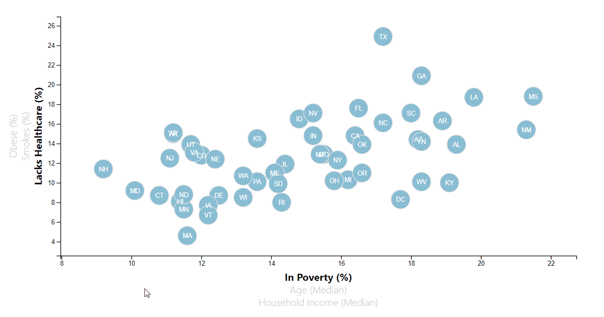

# data-journalism-and-d3
Data Journalism and D3

**Description**  
HTML page containing an SVG scatter plot, created using D3.js.  The underlying data with various statistics related to poverty and healthcare in the United Staes was loaded from a .csv, and the resulting visualization features selectable axes (and transitions) to view multiple correlations.  Tooltips are also incorporated to allow viewing of the statistics associated with each point on the chart.  

**Contents**
* db/  
  * belly_button_biodiversity.sqlite  
  * bellybutton.sqlite  
* screenshots/  
  * dashboard.png  
* static/  
  * js/  
    * app.js  
    * bonus.js  
* templates/  
  * index.html  
* app.py